---

  <table>
    <tr>
      <td align="center" width="45%">
        
      </td>
      <td align="center" width="55%">
        
      </td>
    </tr>
  </table>

  <picture>
    <source media="(prefers-color-scheme: dark)" srcset="https://raw.githubusercontent.com/nishanthcr7777/nishanthcr7777/output/github-snake-dark.svg" />
    <source media="(prefers-color-scheme: light)" srcset="https://raw.githubusercontent.com/nishanthcr7777/nishanthcr7777/output/github-snake.svg" />
    
  </picture>

---

##  About Me

I'm a Backend Engineer and AI-Native Systems Builder from Chennai, currently pursuing B.Tech in Information Technology at Chennai Institute of Technology. Former **SDE Intern at TVS Automobile Solutions (TVS Group)** and **Open-Source Contributor at BrainGlobe**, I build production-grade backend systems, AI-native developer tools, and secure smart contract infrastructure. My work lives at the intersection of **secure architectures**, **deterministic pipelines**, and **AI-assisted developer tooling** — including **NexOps Protocol** for Bitcoin Cash smart contracts.

---

##  Projects

### NexOps Protocol

AI-assisted developer infrastructure for generating, auditing, and deploying secure **CashScript smart contracts** on the Bitcoin Cash network.

  
  
  

  <a href="https://nexops.cash">Landing</a> •
  <a href="https://app.nexops.cash">Protocol App</a> •
  <a href="https://docs.nexops.cash">Documentation</a> •
  <a href="https://hub.nexops.cash">NexHub Registry</a> •
  <a href="https://wiz.nexops.cash">NexWizard Builder</a>

### Featured Projects

- **NexOps Protocol** — AI-assisted infrastructure for generating, auditing, and deploying secure Bitcoin Cash smart contracts. → https://github.com/NexOps-cash
- **HelmOS** — An AI operating system for founders that combines memory, planning, research, and execution into a single workspace.
- **Bulk Resume Analyzer** — AI-powered recruitment intelligence platform for resume analysis, candidate evaluation, and hiring insights.
- **DecohereX** — AI-assisted quantum job orchestration and backend optimization platform for IBM Quantum workloads.

---

  <table>
    <tr>
      <td align="center" width="50%" valign="top">
        
      </td>
      <td align="center" width="50%" valign="top">
        
      </td>
    </tr>
  </table>

##  Connect With Me

  

